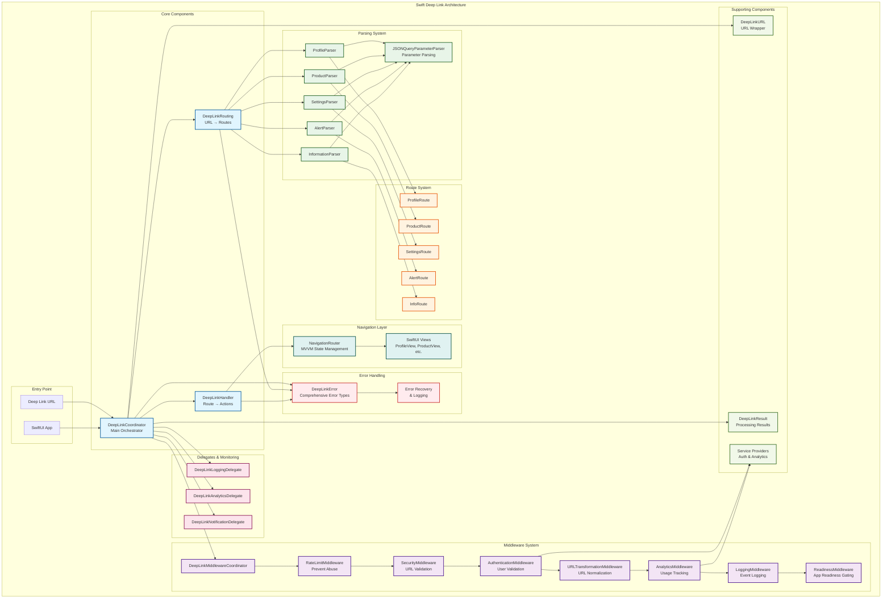

# Swift Deep Link - Architecture Diagram

This document contains the complete architecture diagram of the Swift Deep Link package, showing how all components interact with each other.

## Architecture Diagram

## Component Explanation

### 🔵 Core Components (Blue)
- **DeepLinkCoordinator**: The central orchestrator that coordinates the entire deep link processing flow
- **DeepLinkRouting**: Routing system that connects URLs with appropriate parsers
- **DeepLinkHandler**: Executes the corresponding actions for each identified route

### 🟣 Middleware System (Purple)
Middleware pipeline that processes URLs in sequential order:
1. **Rate Limiting** → Prevents abuse and spam of deep links
2. **Security** → Validates URLs against security policies
3. **Authentication** → Validates users for protected routes
4. **URL Transformation** → Normalizes and standardizes URLs
5. **Analytics** → Tracks usage and deep link metrics
6. **Logging** → Records events for debugging and monitoring
7. **Readiness** → Queues deep links until the app is ready, then drains them for reprocessing

### 🟢 Parsing System (Green)
- **Specific parsers** for each type of deep link (Profile, Product, Settings, etc.)
- **JSONQueryParameterParser** for robust parsing of query parameters
- Each parser converts URLs into structured and typed route objects

### 🟠 Route System (Orange)
- **Typed routes** that represent specific navigation destinations
- Each route has a unique ID and specific parameters for its context

### 🔴 Delegates and Monitoring (Pink)
- **LoggingDelegate**: Provides detailed logging of events
- **AnalyticsDelegate**: Analytics tracking and usage metrics
- **NotificationDelegate**: User notifications about processing status

### 🟢 Navigation Layer (Teal)
- **NavigationRouter**: MVVM state management with the Observation framework
- **SwiftUI Views**: Reactive user interfaces that respond to state changes

### 🔴 Error Handling (Red)
- **DeepLinkError**: Comprehensive and localized error types
- **Error Recovery**: Elegant recovery and error logging

### 🟢 Supporting Components (Light Green)
- **DeepLinkURL**: URL wrapper with extended functionality
- **DeepLinkResult**: Detailed processing results
- **Service Providers**: Service providers for authentication and analytics

## Processing Flow

1. **URL Entry** → The deep link URL enters the system
2. **Middleware Pipeline** → Processes, validates and transforms the URL
3. **Routing** → Finds the appropriate parser for the URL
4. **Parsing** → Converts the URL into structured routes
5. **Handling** → Executes the corresponding navigation actions
6. **Navigation** → Updates the UI and application state
7. **Monitoring** → Records events, metrics and notifications

## Benefits of this Architecture

- **🔒 Type Safety**: Generic-based design for compile-time safety
- **🧩 Modularity**: Easy to extend without modifying existing code
- **🧪 Testability**: Protocol-oriented design for easy testing and mocking
- **⚡ Concurrency**: Full support for async/await and Swift concurrency
- **📊 Observability**: Integrated logging, analytics and monitoring
- **🛡️ Security**: Robust validation and configurable security policies
- **🎯 Scalability**: Architecture that grows with application needs

## See Also

- [How to Use DeepLink](./how-to-use-deeplink-en.md) - Complete implementation guide
- [API Reference](./api-reference-en.md) - Detailed API documentation
- [FAQ](./faq.md) - Frequently asked questions and troubleshooting