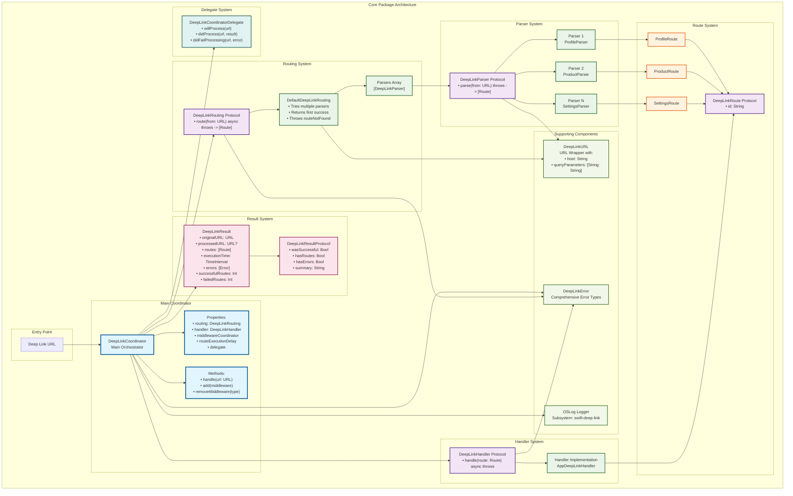

# Swift Deep Link - Core Package Architecture

This document contains the specific architecture diagram of the Swift Deep Link Core package, showing the internal structure and interactions between the main components.

## Core Architecture Diagram

## Core Components Explanation

### 🔵 DeepLinkCoordinator (Blue)
**The central orchestrator of the system**

- **Purpose**: Coordinates the entire deep link processing flow
- **Responsibilities**:
  - Process URLs through the middleware system
  - Route URLs using the routing system
  - Execute handlers for each found route
  - Manage delegates for notifications
  - Provide execution metrics

- **Key Properties**:
  - `routing`: Routing system
  - `handler`: Route handler
  - `middlewareCoordinator`: Middleware coordinator
  - `routeExecutionDelay`: Delay between route executions
  - `delegate`: Delegate for notifications

### 🟣 Protocols (Purple)
**Interfaces that define contracts**

- **DeepLinkRouting**: Defines how to route URLs to routes
- **DeepLinkParser**: Defines how to parse URLs into routes
- **DeepLinkHandler**: Defines how to handle specific routes
- **DeepLinkRoute**: Defines the structure of a route
- **DeepLinkResultProtocol**: Defines result properties
- **DeepLinkCoordinatorDelegate**: Defines coordinator notifications

### 🟢 Implementations (Green)
**Concrete implementations of protocols**

- **DefaultDeepLinkRouting**: Standard implementation that tries multiple parsers
- **Parsers Array**: Collection of specific parsers
- **Parser Implementations**: Concrete parsers (Profile, Product, Settings)
- **Handler Implementation**: Concrete handler implementation

### 🟠 Route System (Orange)
**Typed and structured routes**

- **Route Types**: Specific route types (Profile, Product, Settings)
- **Route Protocol**: Base protocol that all routes must implement
- **Route ID**: Unique identifier for each route

### 🔴 Result System (Pink)
**Complete processing information**

- **DeepLinkResult**: Complete structure with metrics and state
- **Result Properties**: Convenience properties for analysis
- **Execution Metrics**: Execution time and success/failure counts

### 🟢 Supporting Components (Light Green)
**Utilities and auxiliary components**

- **DeepLinkURL**: URL wrapper with extended functionality
- **DeepLinkError**: Comprehensive and localized error types
- **OSLog Logger**: Integrated logging system

### 🟢 Delegate System (Teal)
**Notifications and callbacks**

- **CoordinatorDelegate**: Notifications about processing status
- **Lifecycle Methods**: willProcess, didProcess, didFailProcessing

## Core Processing Flow

1. **URL Entry** → URL enters DeepLinkCoordinator
2. **Middleware Processing** → URL is processed through middleware
3. **Routing** → DefaultDeepLinkRouting tries parsers in sequence
4. **Parsing** → Successful parser converts URL into routes
5. **Route Creation** → Typed route objects are created
6. **Handler Execution** → Handler processes each found route
7. **Result Generation** → DeepLinkResult is generated with complete metrics
8. **Delegate Notifications** → Result is notified to delegates

## Key Core Features

- **🔒 Type Safety**: Generic-based design with `Route: DeepLinkRoute`
- **⚡ Async/Await**: Full support for modern concurrency
- **🧪 Protocol-Oriented**: Protocol-based design for easy testing
- **📊 Comprehensive Results**: Detailed execution metrics
- **🔔 Delegate Pattern**: Reactive state notifications
- **🛡️ Error Handling**: Robust error handling at each layer
- **📝 Logging**: Integrated OSLog logging for debugging

## Benefits of this Core Architecture

- **Separation of Concerns**: Each component has a specific responsibility
- **Extensibility**: Easy to add new parsers and handlers
- **Testability**: Protocols allow easy mocking and testing
- **Observability**: Complete metrics and detailed logging
- **Thread Safety**: Concurrency-safe design
- **Performance**: Efficient processing with configurable delays

## See Also

- [Complete Architecture Diagram](./architecture-diagram.md) - Complete system overview
- [How to Use DeepLink](./how-to-use-deeplink-en.md) - Implementation guide
- [API Reference](./api-reference-en.md) - Detailed API documentation